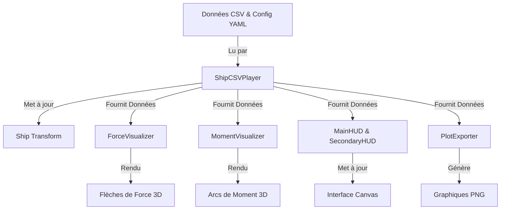

# Vue d'Ensemble de l'Architecture

Ce document fournit une vue d'ensemble de haut niveau de l'architecture du système **NavireVisualization**.

## Diagramme du Système

## Concepts Fondamentaux

### 1. La Structure de Données "Frame"
L'unité centrale de données dans le système est la classe `FrameData` (définie dans `ShipCSVPlayer`). Elle contient l'état complet du navire pour un pas de temps unique :
*   **Temps** : Temps de simulation en secondes.
*   **Cinématique** : Position (x, y, z), Rotation (phi, theta, psi), Vitesses (u, v, w).
*   **Dynamique** : Toutes les forces et moments agissant sur le navire, ventilés par composante (Gravité, Hydrostatique, Diffraction, etc.).

### 2. Systèmes de Coordonnées
Un aspect critique de ce projet est la conversion entre le système de coordonnées de la simulation et celui d'Unity.

*   **Repère de Simulation (NED)** :
    *   **X** : Nord (Avant)
    *   **Y** : Est (Tribord)
    *   **Z** : Bas
*   **Repère Unity** :
    *   **X** : Droite
    *   **Y** : Haut
    *   **Z** : Avant

Le `ShipCSVPlayer` gère cette conversion automatiquement :
*   `Unity X` = `NED Y`
*   `Unity Y` = `- NED Z`
*   `Unity Z` = `NED X`

### 3. La Boucle de Mise à Jour (Update Loop)
1.  **Entrée** : `ShipCSVPlayer` lit le `Time.time` actuel (mis à l'échelle par `playbackSpeed`).
2.  **Recherche** : Il trouve les deux trames de données les plus proches dans la liste CSV chargée.
3.  **Interpolation** : Il effectue une interpolation linéaire (`Lerp`) entre ces deux trames pour calculer l'état exact pour la trame de rendu actuelle.
4.  **Application** :
    *   Le `Transform` du navire est mis à jour.
    *   `ForceVisualizer` et `MomentVisualizer` lisent les vecteurs de force/moment interpolés et mettent à jour leurs maillages (meshes).
    *   `MainHUD` met à jour le texte à l'écran.

## Dépendances

*   **Crest Ocean System** : Utilisé pour le rendu de la surface de l'océan. Le navire se déplace indépendamment de la physique de l'océan (il suit le CSV), mais interagit visuellement avec l'eau.
*   **TextMeshPro** : Utilisé pour le rendu de texte de haute qualité dans le HUD.
